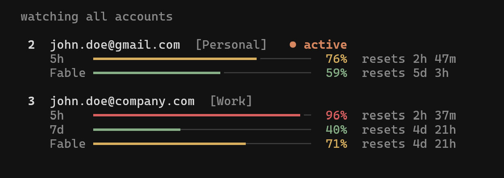

# claude-swap

Multi-account switcher for Claude Code. Easily switch between multiple Claude accounts without logging out, or let it switch for you before you hit a rate limit. Track usage for every account in a live dashboard, and run accounts in parallel. Works with both the Claude Code CLI and the VS Code extension.

## Installation

### Using uv (recommended)

```bash
uv tool install claude-swap
```

### Using pipx

```bash
pipx install claude-swap
```

### From source

```bash
git clone https://github.com/realiti4/claude-swap.git
cd claude-swap
uv sync
uv run cswap help
```

### Updating

```bash
cswap upgrade          # uv/pipx installs on macOS/Linux: auto-detects and upgrades
# or run your installer directly:
uv tool upgrade claude-swap
pipx upgrade claude-swap
```

## Usage

### Add your first account

Log into Claude Code with your first account, then:

```bash
cswap add
```

### Add more accounts

Log in with another account, then:

```bash
cswap add
```

Do not run `/logout` first: current Claude Code may revoke the refresh token stored for the account you are leaving.

### Switch accounts

Rotate to the next account:

```bash
cswap switch
```

Or switch to a specific account:

```bash
cswap switch 2
cswap switch user@example.com
cswap switch dev                # or by alias, once set with `cswap alias 2 dev`
```

Not sure which one? `cswap list` is the dashboard — every account's 5-hour and 7-day usage and reset times at a glance:

```bash
cswap list
```

Or let claude-swap auto-pick by remaining quota — `cswap switch --strategy best` (most quota left) or `--strategy next-available` (skip rate-limited accounts).

**Note:** You usually don't need to restart — on Linux/Windows the new account is picked up automatically, and on macOS after the Keychain cache expires. To apply it instantly, restart Claude Code or reopen the VS Code extension tab. See [Tips](#tips) for the per-platform details.

### Automatic switching

Let claude-swap watch your usage and switch for you. When the active account's 5-hour or 7-day window reaches the threshold (default 90%), it switches to the account with the most quota left — before you hit the limit, and safe to run while Claude Code is working:

```bash
cswap auto                     # foreground loop, polls every 60s
cswap auto --threshold 80      # switch earlier
cswap auto --model Fable       # also switch when the Fable weekly limit is hit
cswap auto --once              # single check-and-switch, for cron/scripts
cswap auto --dry-run           # log what it would do, never switch
cswap auto --strategy consume-first   # burn the soonest-resetting account first
cswap auto --strategy balance         # keep every account's week on schedule
```

<details>
<summary>How it behaves & advanced usage</summary>

- Runs safely alongside Claude Code: switches take the same credential locks Claude Code uses, so a swap never collides with a token refresh.
- A cooldown (default 5 min) and a hysteresis margin stop it flip-flopping near the threshold: a proactive switch only lands on an account that's below the threshold *and* better than the current one by the margin — a candidate that clears the margin is always taken, but two accounts hovering at the line never ping-pong. When every account is exhausted it keeps checking on a bounded slow cadence, waking sooner for an imminent reset.
- **Strategies** (`--strategy`, or `cswap config set autoswitch.strategy`): `best` (default) stays put until the active account nears its limit, then moves to the account with the most quota left. `consume-first` proactively keeps you on the account whose **weekly window resets soonest** — use-it-or-lose-it — switching to a sooner-resetting account (with room to spare) even below the threshold, so perishable weekly quota isn't wasted. `balance` switches exactly when `best` does, but picks the account that is furthest **behind an even weekly schedule** — so every account's weekly quota gets spent shortly before its own reset instead of one account being drained while the rest sit idle, and several accounts keep 5-hour headroom at the same time.
  - **How `balance` scores:** among the accounts that clear the usual health checks — below the threshold, better than the current account by the hysteresis margin, and not the one you just switched away from — each account's on-schedule target is `min(100, 100 × elapsed / (7 days − lead))`, where `elapsed` is the time since its weekly window started; `slack = target − weekly %` (positive = behind schedule). An account is then set aside if its projected 5-hour usage would reach `autoswitch.balanceFiveHourCeiling` (default 85), or its weekly or `--model` window is already at the threshold; whatever remains is ranked by `slack − balanceFiveHourWeight × projected 5-hour %`, highest first. If nothing qualifies, `balance` falls back to whichever surviving account's limiting window comes back soonest, so it never refuses to move while any account still has room. The threshold, cooldown, and the "every account above the threshold" fallback all work the same as for `best`.
  - **Tuning** (`cswap config set …`): `autoswitch.balanceLeadHours` (default 24, 0–96) — finish each week this many hours before its reset; `autoswitch.balanceFiveHourCeiling` (default 85, 10–100); `autoswitch.balanceFiveHourWeight` (default 0.5, 0–5) — how strongly an emptier 5-hour window is preferred; `autoswitch.balanceLoadPerSession` (default 15, 0–100) — 5-hour % each busy Claude Code session is assumed to add, which is what keeps several [managed sessions](#balanced-managed-sessions-cswap-run---auto) from piling onto the same account.
- Usage polling is adaptive — a couple of accounts per check, busy alternates watched more closely, and exhausted ones checked about every ten minutes (or slower after 429s) — so API traffic stays flat no matter how many accounts you manage.
- It fails safe: if a usage check errors it keeps trusting the last-known numbers while retries back off, and an expired token on an idle machine makes it hold rather than fail over (Claude Code refreshes the token on your next message).
- An account whose refresh token has died is quarantined and reported until you either log in with it and re-run `cswap add --slot N`, or replace its stored credentials from a known-good export — a plain `cswap import backup.cswap` replaces dead-token slots on its own (`--force` is still required to replace other existing accounts; note a stale export can carry an already-superseded token). API-key accounts are never rotated onto unless you pass `--include-api-key-accounts`.
- To hold an account out of rotation yourself — a work account you don't want touched, one you're resting — run `cswap disable <num|email>`; `cswap enable <num|email>` puts it back. Disabled accounts are skipped by auto-switch, bare `cswap switch`, and the `best` / `next-available` strategies, but stay fully managed and remain a valid explicit `cswap switch <num|email>` target. They show a `(disabled)` marker in `cswap list`, in the [TUI](#interactive-dashboard-tui), and in the [menu bar](#menu-bar-macos) — both of which also let you toggle the state in place (TUI: menu → *Disable / enable account…*; menu bar: *Disable / enable account*).
- By default only the account-wide 5h/7d windows drive switching. If you work on one model and hit its **weekly per-model limit** first (e.g. Fable), add `--model Fable` (or `cswap config set autoswitch.model Fable`) to fold that model's window into the decision, so it switches off an account whose model quota is spent even while its 5h/7d windows still have room.
  - **Model names** are Anthropic's own per-model `display_name`s, matched case-insensitively. The exact strings for your accounts are the per-model rows in `cswap list` (e.g. a line reading `Fable: 100%`).

For cron/systemd timers, `--once` reports the outcome in its exit code (`0` switched, `1` error, `2` nothing to do, `3` blocked — no viable target), and `--json` emits one JSON event per line:

```bash
*/5 * * * * cswap auto --once --json >> ~/.cswap-auto.log 2>&1
```

Defaults like the threshold and cooldown are configurable with `cswap config set autoswitch.threshold 80` — flags override them (see [Configuration](#configuration)).

</details>

### Run multiple accounts at the same time (session mode)

Launch Claude Code as a specific account in the current terminal only — every other terminal and the VS Code extension stay on your default account, so two accounts can work in parallel.

```bash
cswap run 2                     # launch Claude Code as account 2, here only
cswap run user@example.com      # by email
cswap run 2 -- --resume         # everything after '--' is forwarded to claude
cswap run 2 --share-history     # share your chat history with this account too
cswap run 2 --require-session   # refuse rather than run plain claude if 2 is the default login
```

Sessions use your normal `~/.claude` setup (settings, CLAUDE.md, skills, MCP servers, etc.), but each account keeps its own chat history — pass `--share-history` if you want your accounts to continue the same conversations.

Running the account that is already your default login launches plain `claude` on that login instead of a session (a second copy of the active credential would go stale). Scripts that need the isolation guaranteed can pass `--require-session`, which refuses in that case instead.
  
A session refreshes its own copy of the account's token, so once it exits, the credential it rotated is captured back into the account's stored backup before a switch or usage check uses that backup. While a session is still running, `cswap switch` refuses to move the default login onto its account if the stored backup has already fallen behind (activating it could only fail); exit the session first, or pick another account. While a session runs, its account's usage is read with the session's own credential and never refreshed by cswap; a read the server refuses shows as token expired, and is not requested again, until the session renews the credential on its next call.

<details>
<summary>Sharing details — MCP servers & chat history</summary>

- With `--share-history`, a session started under one account shows up in `--resume` under the others, and nothing already saved is lost.
- User-scope MCP servers (`claude mcp add -s user`) are mirrored from your default profile on every launch — manage them there; changes made inside a session don't persist. Definitions are copied as-is (including inline `env`/`headers` values), but MCP OAuth logins are not — HTTP servers may ask you to authenticate once per profile via `/mcp`.
- `--no-share` turns sharing off and removes the mirrored MCP config (profiles that never mirrored are left alone).

</details>

<details>
<summary>Map accounts to directories — auto-pick per repo</summary>

Bind a directory to an account, and a bare `cswap run` there launches that account in session mode — e.g. work account in work repos, personal elsewhere:

```bash
cswap map 2 ~/work/client-app   # map a directory to account 2
cswap map user@example.com      # map the current directory
cswap map                       # list mappings
cswap unmap ~/work/client-app   # remove one (defaults to current directory)

cd ~/work/client-app/src
cswap run                       # → account 2, session mode
```

Subfolders inherit the nearest mapped ancestor. In an unmapped directory, `cswap run` just launches plain `claude` with your default login. Mappings are per-machine (not part of `cswap export`) and are cleaned up when their account is removed.

</details>

### Balanced managed sessions (`cswap run --auto`)

Let cswap pick the account for each new terminal, so parallel sessions spread across your accounts instead of all burning one 5-hour window:

```bash
cswap run --auto                # launch Claude Code on the best account right now
cswap run --auto -- --resume    # everything after '--' is forwarded to claude
cswap sessions                  # list running managed sessions
cswap sessions --json           # same, machine-readable
```

- A managed session never lands on your default login's account while another account can take it. Among the rest, cswap picks whichever account the weekly schedule says is furthest behind — the same target-vs-actual formula the `balance` autoswitch strategy uses (see above) — with room left in its current 5-hour window; every busy session already placed on an account counts against that room, including one still starting up (Claude hasn't recorded a status for it yet) — an idle one doesn't. If no account is clear of both thresholds, the session goes to whichever one's quota frees up soonest. Quarantined accounts, API-key accounts, and any account that already has its own live `cswap run N` session are never candidates.
- Only when nothing else can take the session — every other account is at its limit or its usage can't be read — does a managed session fall back to your default login, borrowing a read-only copy of its current access token; it never touches its refresh token. While it holds that copy it re-checks at most once a minute, not on every prompt, that the login hasn't rotated the token underneath it.
- `--auto` can't be combined with an explicit `NUM|EMAIL`, `--no-share`, `--require-session`, or `--no-share-history`: a managed session always shares settings, keybindings, CLAUDE.md, skills, commands, agents, MCP servers and chat history with `~/.claude`, the same as `cswap run NUM --share-history`, so `--resume` shows the same conversations whichever account a session lands on.
- A managed session keeps itself working, with or without a daemon. On every prompt you submit — including the ones where it finds nothing to do, at about 0.1s each, almost all of it Python starting up — it replaces its own access token if that token is within ten minutes of expiring, and it moves itself off an account that has hit a limit or that `cswap auto` has quarantined. `cswap auto` (or the menu bar app's auto-switch, which runs the same engine) does both for every managed session on each of its checks, so a session that has either one keeps working.
- The half a session does for itself depends on Claude Code hooks, which cswap registers **when the session launches**: a session that was already running when you upgraded keeps the old behaviour until you start a new one. Hooks don't run if Claude Code is in safe mode (`--safe-mode`), if `disableAllHooks` is set in whichever settings file applies (yours, the project's, or your organization's), or if your organization's managed settings set `allowManagedHooksOnly`. A session in one of those depends on `cswap auto` as before.
- A running session can change account. It moves as soon as the account it's on is out of quota — at the moment you press enter, or on `cswap auto`'s next check, even mid-turn, since a session on an exhausted account can't work anyway. Balancing moves are the daemon's alone and wait for quiet: the session must have been idle for `sessions.idleReassignMinutes` (default 60) and another account must score `sessions.reassignMargin` (default 15) better on the balance scale, because moving a session invalidates its prompt cache and after an hour idle that cache has expired on its own. `autoswitch.cooldownSeconds` (default 300) bounds how often `cswap auto` will try to move the same session.
- Nothing changes inside the session when it moves: Claude picks the new token up on its next request, and your conversation, transcript and `--resume` history are untouched — history is shared with `~/.claude`, so the same conversation continues on whichever account the session is now on. A move that lands mid-turn doesn't rescue the reply in flight, which still hits the old account's limit; what you send after it goes out on the new account. `cswap sessions` shows where the session went and why (`lastAssignedAt`, `lastReason`), and so do `cswap auto`'s log and `--json` stream (a `session-reassigned` event), the dashboard's auto view and the menu bar.
- When a session exits it hands the account back itself — registry row, profile directory and, on macOS, its Keychain item — so the next `cswap run --auto` can place onto that account right away. If something else is still working inside the profile (a background process that inherited `CLAUDE_CONFIG_DIR`), the directory is left where it is. A session killed outright, or one whose hooks never ran, is reclaimed instead by `cswap auto`'s next check or the next `cswap run --auto`.
- macOS and Linux only for now; on Windows use `cswap run NUM`.

`cswap sessions` lists each live session's id, pid, account, and Claude's own status (`starting` before it registers, `busy`, or `idle since …`), plus its working directory and when/why it was placed there. `--json` emits `{"schemaVersion": 1, "sessions": [...]}`, one object per session with `id`, `pid`, `account` (`{number, email}`), `organizationUuid`, `source` (`"backup"`, or `"lane0"` for a session borrowing the default login's token), `status`, `cwd`, `idleSince`, `createdAt`, `lastAssignedAt`, and `lastReason`.

The [dashboard](#interactive-dashboard-tui), `cswap watch` and the [menu bar](#menu-bar-macos) show how many managed sessions each account is carrying, beside its usage. That count can run high when no daemon is running: a session that was killed outright keeps counting until something sweeps it — which only `cswap auto` and the next `cswap run --auto` do — and so does a row whose PID the system has since handed to something unrelated. The menu bar can be refreshing as rarely as every five minutes on top of that. `cswap sessions` is the reliable answer.

The idle rule for balancing moves has two settings of its own:

```bash
cswap config set sessions.idleReassignMinutes 30   # 5–1440
cswap config set sessions.reassignMargin 25        # 0–100
```

### Interactive dashboard (TUI)

Run `cswap` on its own (or `cswap tui`) for the full-screen dashboard: live usage for every account, switching, and the auto-switcher, all keyboard-driven. `cswap watch` opens it straight to the live monitor. Works on macOS, Linux, and Windows.



### Refresh expired tokens

If an account's token expires, log back into Claude Code with that account and re-run:

```bash
cswap add
```

This will update the stored credentials without creating a duplicate.

### Other commands

```bash
cswap run 2                     # Run an account in this terminal only (session mode)
cswap run --auto                # Launch a managed session on the balance-picked account
cswap sessions                  # List running managed sessions
cswap auto                      # Auto-switch when nearing rate limits (see above)
cswap config                    # Show or edit settings (see Configuration below)
cswap list                      # Show all accounts with 5h/7d usage and reset times
cswap list --token-status       # Add source-labelled OAuth token diagnostics
cswap status                    # Show current account
cswap add --slot 3              # Add account to a specific slot (prompts before overwrite)
cswap add --alias dev           # Add account and give it a short alias
cswap remove 2                  # Remove an account
cswap disable 2                 # Hold an account out of auto-rotation (keeps its login)
cswap enable 2                  # Return a disabled account to rotation
cswap alias 2 dev               # Give an account a short alias (usable anywhere NUM|EMAIL is)
cswap alias 2 --unset           # Remove an account's alias
cswap alias                     # List all aliases
cswap move 2 1                  # Assign an account to a slot (relocates to an empty slot, swaps if taken)
cswap unclaimed                 # List stashed credential entries (slot + why they were stashed)
cswap unclaimed --purge ID      # Drop one (deletes its bytes; recover with /login + `cswap add`)
cswap tui                       # Interactive dashboard (also: bare `cswap`)
cswap watch                     # Dashboard, opened on the live watch page
cswap upgrade                   # Upgrade claude-swap to the latest version
cswap purge                     # Remove all claude-swap data
```

The original flag spellings (`cswap --switch`, `cswap --list`, ...) keep working.

## Tips

- **Do you need to restart after switching?** Usually not. On **Linux and Windows**, credentials are stored in a file and Claude Code re-reads them whenever that file changes, so the new account takes effect on your next message — no restart needed. On **macOS**, credentials live in the Keychain, which Claude Code caches for about 30 seconds; a running session picks up the switch once that cache expires. Restart Claude Code (or close and reopen the VS Code extension tab) only if you want the change to apply instantly.
- **Continuing sessions after switching:** You can keep using the same Claude Code session after switching — run `cswap switch` in any terminal and carry on. If you'd prefer a clean start, close and reopen Claude Code (or the VS Code extension tab) and use `--resume` to pick your previous session. Either way, the first message on the new account may use extra usage as its conversation cache rebuilds.

## How it works

- Backs up OAuth tokens and config when you add an account
- Swaps only the account-specific Claude login when you switch accounts;
  live account-independent OAuth state (such as MCP server logins) is
  preserved instead of being overwritten by a slot's older snapshot
- Account credentials stored securely using platform-appropriate methods
- Switches (manual and automatic) hold Claude Code's own credential locks while writing, so a swap never interleaves with a token refresh
- Auto-switch freshens a target's token before activating it, and quarantines accounts whose refresh token has died (recover by re-adding it with `cswap add --slot N`, or by replacing its stored credentials from a known-good export — a plain `cswap import backup.cswap` replaces dead-token slots automatically)
- Managed sessions (`cswap run --auto`) hold an access token only — never a refresh token. Each one checks its own on every prompt you submit and replaces it once it is within ten minutes of expiring, and `cswap auto` does the same for all of them on each of its checks; where Claude Code runs hooks, either one alone keeps them working ([details](#balanced-managed-sessions-cswap-run---auto))
- Usage numbers refresh every few minutes — faster for an account being used or close to switching, slower for idle ones — keeping cswap comfortably inside Anthropic's rate limits however many dashboards you keep open on a machine. An age note like `· 6m ago` just means the next scheduled check hasn't come yet, not that something is stuck.

## Data locations

| Platform | Credentials | Config backups |
|----------|-------------|----------------|
| Windows | File-based (inside the backup directory, under `credentials/`) | `~/.claude-swap-backup/` |
| macOS | macOS Keychain | `~/.claude-swap-backup/` |
| Linux / WSL | File-based (inside the backup directory, under `credentials/`) | `${XDG_DATA_HOME:-~/.local/share}/claude-swap/` |

Session-mode profiles (`cswap run`) live under the backup directory in `sessions/`; managed sessions (`cswap run --auto`) live alongside them in `sessions/<id>/` (ids look like `auto-1a2b3c4d`) and are tracked in `sessions/managed.json`. Each managed profile also holds the `--settings` document Claude Code is launched with, which is where its two hooks are registered, and small dot-file stamps recording when it last re-checked a borrowed token and last considered a move. Tool preferences (`settings.json`) and auto-switch state (`autoswitch_state.json` — quarantined accounts, the switch cooldown, a per-session move cooldown, and the claims that stop two engines moving the same session at once; delete it to reset) live in the backup directory root.

On Linux/WSL, set `XDG_DATA_HOME` to override the default location.

## Menu bar (macOS)

<details>
<summary>Optional macOS menu bar app — usage at a glance, click to switch</summary>

Needs the `menubar` extra (macOS only):

```bash
uv tool install 'claude-swap[menubar]'   # or: pipx install 'claude-swap[menubar]'
cswap menubar
```

Shows every account's 5h / 7d / spend usage and switches with a click (specific / rotate / best / next-available), plus the TUI's add / disable-enable / remove / refresh actions. Enable *Settings → Auto-switch accounts* to run the same engine as [`cswap auto`](#automatic-switching) in the background; it shares the `autoswitch.*` settings, so the menu bar and CLI stay in sync. Off until you turn it on.

**Keep it running without a terminal.** `cswap menubar` runs in the foreground, so the status item dies with the terminal that started it and does not come back after a reboot. `--install-service` hands it to launchd instead — starts at login, restarts on crash, no `.app` bundle:

```bash
cswap menubar --install-service     # start now, and at every login
cswap menubar --service-status      # installed? loaded? pid?
cswap menubar --uninstall-service   # stop it and remove the plist
```

The agent lives at `~/Library/LaunchAgents/com.cswap.menubar.plist` and logs to `~/Library/Logs/com.cswap.menubar.{log,err}`. It pins the `cswap` console script, whose path survives an upgrade — but the running process keeps the old build until it restarts, so after `cswap upgrade` either re-run `--install-service` or `launchctl kickstart -k gui/$(id -u)/com.cswap.menubar`.

</details>

## Advanced

### Configuration

Tool preferences live in `settings.json` in the backup root; `cswap config` reads and edits it with validation, so you never have to find the file or guess valid ranges.

<details>
<summary>Commands & usage</summary>

```bash
cswap config                              # list effective settings ("(default)" = not set)
cswap config get autoswitch.threshold
cswap config set autoswitch.threshold 80  # validated: rejects out-of-range values loudly
cswap config set autoswitch.model Fable   # per-model switching (see "auto"); Fable,Opus for several
cswap config set autoswitch.strategy balance  # spend every account's week on schedule (see "auto")
cswap config unset autoswitch.threshold   # back to the default
cswap config path                         # where settings.json lives
```

`cswap config --help` lists every key with its valid range and default. Hand-editing the file still works — `cswap config` is just a safer front door. `list` and `get` take `--json` for scripting.

</details>

### Backup and migration

Move account data between machines or back it up:

```bash
cswap export backup.cswap                    # All accounts to a file
cswap export backup.cswap --account 2        # One account
cswap export backup.cswap --full             # Include full ~/.claude.json and credential object (same-PC backup)
cswap import backup.cswap                    # Skips accounts that already exist
cswap import backup.cswap --force            # Overwrite existing
```

The export file is plaintext JSON and, by default, carries only each account's own login — machine-shared MCP/plugin OAuth tokens and the device token stay on the source machine (`--full` keeps everything, for same-PC backups). If you need encryption, pipe through your tool of choice (e.g. `cswap export - | gpg -c > backup.gpg`).

If an imported account is the one you're currently logged in as, activate the imported credentials with `cswap switch N --force` (a plain `switch` to the current account is a safe no-op and won't touch the import).

### JSON output for scripting

Add `--json` to `list`, `status`, or `switch` to emit a single machine-readable JSON object on stdout (human-readable notices go to stderr). Useful for scripting auto-swap and quota tracking.

```bash
cswap list --json                   # all accounts with usage/quota
cswap status --json                 # current active account
cswap switch --strategy best --json # switch, then report the result
cswap switch 2 --json
```

<details>
<summary>Example output & schema notes</summary>

```json
{
  "schemaVersion": 1,
  "activeAccountNumber": 2,
  "accounts": [
    { "number": 2, "email": "you@example.com", "active": true, "usageStatus": "ok",
      "usage": { "fiveHour": { "pct": 25.0, "resetsAt": "2026-06-22T23:29:59Z" },
                 "sevenDay": { "pct": 16.0, "resetsAt": "2026-06-26T17:59:59Z" } } }
  ]
}
```

Every payload carries a `schemaVersion` (currently `1`); on a handled error stdout is `{"schemaVersion":1,"error":{...}}` with a non-zero exit code. `--switch`/`--switch-to` report `{"switched": true|false, "from": …, "to": …, "reason": …}`.

Usage is served from a per-account cache: when the usage API is briefly unreachable, the last-known numbers are shown instead of nothing (the human view marks them with their age, e.g. `· 2m ago`). Rows with decision-trusted usage carry additive `usageFetchedAt`/`usageAgeSeconds` fields telling you how old the measurement is. Whenever `usage` is null but a last-known measurement exists — data too old to drive a decision (`usageStatus` stays `unavailable`), or a row in a non-`ok` state such as `token_expired` — additive `lastGoodUsage`/`lastGoodFetchedAt`/`lastGoodAgeSeconds` fields preserve the human display without making the account actionable. When `usage` is null and nothing else explains it (`usageStatus` is `unavailable`), an additive `usageError` names the last fetch failure by kind (e.g. `http-429`, `timeout`) and, while the cache is backing off from it, `usageRetryAt` gives the time of the next attempt. These fields apply to list rows and the managed active row from `status --json`. An account held out of rotation with `cswap disable` carries an additive `"disabled": true` on its row (absent otherwise).

A row carries an additive `loginExpiresAt` (ISO-8601 UTC) when the stored login records when its refresh token expires, which is the moment the slot will need a fresh `/login` and `cswap add --slot N`; a script can warn a few days ahead instead of discovering `relogin_required`. Absent when Claude Code recorded no such date for that login.

An account row also carries an additive `alias` field once one is set with `cswap alias` (e.g. `"alias": "dev"`); accounts without one simply omit the key.

Weekly windows (`sevenDay` and per-model `scoped` entries — never `fiveHour`) additively carry pace fields once the week is ~a day old: `expectedPct` (where usage would sit if spread evenly across the week) and `aheadOfPace` (`true` when meaningfully above that — the same signal the human views show as an `(ahead)`/`(ahead of pace)` marker). `projectedExhaustionAt`/`willLastToReset` extrapolate the current rate into an ETA to 100% and a yes/no "will it last to the reset"; they stay `--json`-only since a linear projection is too rough to present as fact in the UI.

</details>

`cswap auto --json` emits an event *stream* instead — one JSON object per line (`{"schemaVersion":1,"event":"switch","ts":…, …}` with kinds like `poll`, `switch`, `no-switch`, `account-quarantined`, `all-exhausted`, `error`). The contract is additive: new kinds and fields may appear, so scripts should ignore unknown ones.

### Add an account from a raw token or API key

If you only have a long-lived setup-token (e.g., produced by `claude setup-token`)
or a managed API key (`sk-ant-api...`) and you don't want to log in via the browser
flow first — useful on headless servers or when receiving a token from another
machine — register it directly. The token type is auto-detected:

```bash
cswap add-token sk-ant-oat01-...             # OAuth setup-token
cswap add-token sk-ant-api03-...             # managed API key
cswap add-token sk-ant-oat01-... --slot 3
cswap add-token - --slot 3                   # read token from stdin
cswap add-token --email user@example.com     # optional label override
```

`--email` is optional; omitted values use `setup-token-{slot}@token.local`
(or `api-key-{slot}@token.local` for API keys). No Anthropic API calls are made.

**API-key accounts.** An `sk-ant-api...` value registers a managed API-key account
(the kind Claude Code uses after `/login` with a key) rather than an OAuth
setup-token. It switches like any other account; since API keys have no subscription
quota, they show no usage and the usage-aware `switch` strategies never skip them as
rate-limited.

## Uninstall

Remove all data:

```bash
cswap purge
```

Then uninstall the tool:

```bash
uv tool uninstall claude-swap
# or
pipx uninstall claude-swap
```

## Requirements

- Python 3.12+
- Claude Code installed and logged in

## License

MIT
